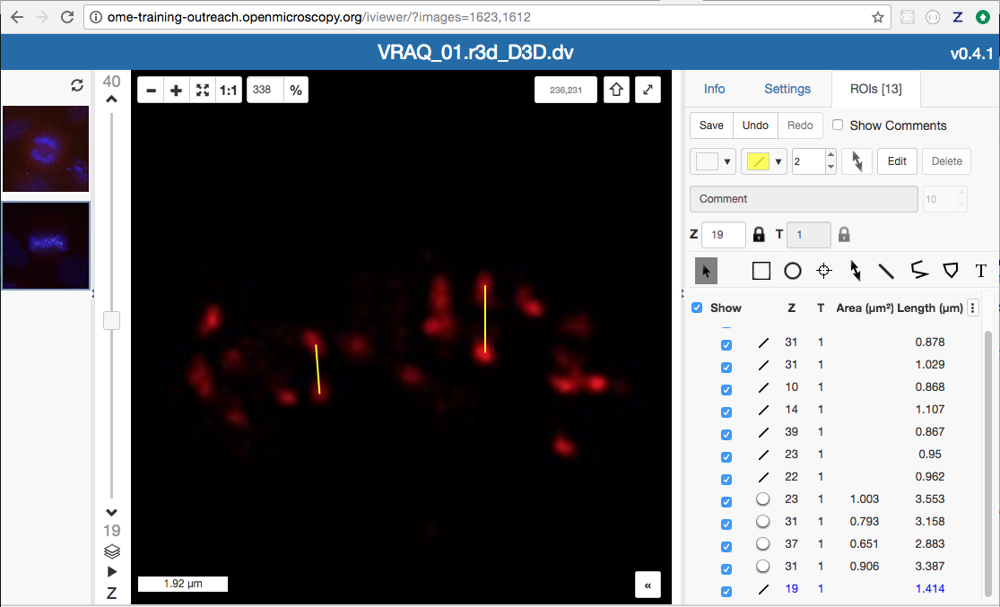
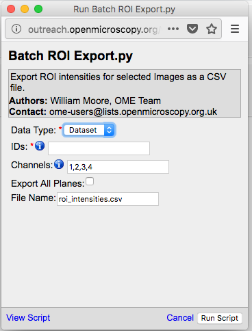

Run server-side scripts
=======================

The server-side Python scripts on OMERO give an opportunity to run the analysis close to the data.

Description
-----------

The server-side Python scripts on OMERO can be accessed via both the OMERO.web and OMERO.insight user interfaces. The scripts are typically uploaded by an administrator or a restricted administrator of the OMERO.server and can be run by any user on the server.

First we show an example of a server-side script with a customized UI.

Secondly, two examples are presented showing the experience from the user interface of OMERO.web (Batch ROI export and Kymograph).

Setup
-----

No specific setup needed.

Resources
---------

-  `siRNAi-HeLa images <https://downloads.openmicroscopy.org/images/DV/siRNAi-HeLa/>`__ for the Batch ROI Export.py script.

-  Images for Kymograph script were downloaded from \ http://jcb.rupress.org/content/194/2/187\ .(Bowen et. al. Journal of Cell Biology 194 (2): 187).

-  The simple example script is available on `hello_world_server.py <https://raw.githubusercontent.com/ome/omero-guide-python/master/scripts/hello_world_server.py>`__.

Step-by-Step
------------

Example 1
~~~~~~~~~

In this example, we create a movie server-side using the script `Make_Movie.py <https://github.com/ome/omero-scripts/blob/develop/omero/export_scripts/Make_Movie.py>`__.
For this script, there is a customized UI for the script that will override the default UI available from the script itself.

#. Select a time-lapse Image in the OMERO.web client and click on the ``Publish`` icon in the toolbar.

    .. image:: images/scripts9.png

#. Select ``Make Movie...`` from the drop-down menu to create a movie from an Image.

#. Select the format from the ``Format`` drop-down.

#. Use the ``Frame Rate`` drop-down to select the frame rate.

#. Set the desired time interval if appropriate.

#. Set the desired Z-section interval if appropriate.

#. Click the button ``Make Movie`` to start the movie creation server side.

    .. image:: images/scripts10.png

Example 2
~~~~~~~~~

#.  We will now analyse the ROIs created in OMERO.iviewer using a server-side script.

#.  Go to the siRNA-HeLa Dataset and open several images whose name start with VRAQ... in OMERO.iviewer.

#.  We want to measure the distance between Centromeres, stained with ACA in the 4th Channel. Turn on ONLY the 4th channel and open the ROIs tab to on the right-hand pane.

#.  Draw several lines between the centromeres as indicated on the screenshot below. \ |image1a|

#.  Try to identify centromere pairs:

    - Select the Line tool and draw a line between the centres of the centromeres.

    - In the ROIs table, in the Comments column, click the 3 dots in the column header and choose to Show Area/Length.

#.  Do the same now on several of the Images whose names start with IN..., which are in the Metaphase state.

#.  Select Dataset siRNA-HeLa.

#.  Click the Script button in the top-right of the page \ |image2a|\ .

#.  Select `export_scripts > Batch_ROI_Export...`

#. In the dialog that pops up, click on View Script to view the Python code.

#. Search for "\ idr\ "# to find the code block that selects the filter_channel based on Dataset and Channel names.

#. Scroll to the bottom of the script to see where the input parameters are defined, such as Data_Type and IDs. Note how these appear in the script dialog and are auto-populated with the currently-selected Datasets or Images.

    .. image:: images/scripts3.png

#. The script will process all the Images in the selected Dataset and data can be exported as CSV file, with one table row per Shape/Channel.

#. Click Run Script.

#. The status of the processing is displayed in the Activities dialog |image4a|\ .

#. When the script has completed, it will show in the Activities dialog and allow you to download the CSV file. Download this and open it, e.g. in Excel, to see the output data for all the shapes.

Example 3
~~~~~~~~~

We will now use another server-side script for creating a Kymograph from an Image in OMERO. The Image we will use for the Kymograph demonstration has been published in a study investigating protein migration along microtubules \ http://jcb.rupress.org/content/194/2/187\ .(Bowen et. al.
Journal of Cell Biology 194 (2): 187).

#. Go to the Dataset Kymograph.

#. Select the Image inside the Dataset.

#. Double-click to open the Image in OMERO.iviewer and draw one or more lines along microtubules which seems to have the most persistent trafficking of objects along them.

#. Save the line(s).

#. Go back to the webclient. Click the Script button in the top-right of the page\ |image2a|\ .

    .. image:: images/scripts5.png

#.  Select workshop_scripts > Kymograph...

#.  The script will create a new image (=Kymograph) where the pixels under the line region you have drawn previously will be collated into this image timepoint by timepoint. The row of pixels from the first timepoint will be on the top of the new Kymograph Image.

#.  Note: the direction in which you have drawn the line ROI on the original image matters with respect to the orientation of the stripes composing the Kymograph image. The start of the original line is on the left of the Kymograph Image, the end on the right.

#.  Open the new Kymograph image in OMERO.iviewer.

#. Find some tracks (typically red stripes going under angles across the image, see screenshot below).

    .. image:: images/scripts6.png
         :width: 1.58333in
         :height: 2.84896in
    .. image:: images/scripts7.png
         :width: 1.53646in
         :height: 2.83333in

#. Draw some lines over these tracks and save them.

#. Go back to the webclient, select the Kymograph Image and select the script analysis > Kymograph analysis...

#. Run this script. The Kymograph analysis script will produce a CSV file attachment on the Kymograph Image.

#. Open the CSV in Excel for example and verify the speeds of the observed particles in the original image.

.. |image2a| image:: images/scripts2.png
   :width: 0.36621in
   :height: 0.27231in

