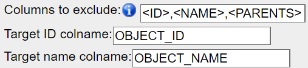
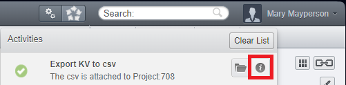

====================
Extended description
====================

Selecting High-Content-Screening
--------------------------------
Selecting HCS data follows the same selection parent/child logic as for \
Projects/Datasets/Images, but with the HCS containers: Screen/Plate/Well/Run/Image

One specificity though is about the **Run** (Acquisition). **Runs** and **Wells** are both \
children objects of a **Plate**, and **Images** are attached to both a **Run** and a **Well**.

  * Selecting **Images** from a **Well** will select all the **Images** inside
    this **Well**.
  * Selecting **Images** from a **Run** will select all the **Images** coming from that
    **Run** (corresponds to a subset of **Images** from all combined **Well**).
  * Selecting **Images** from a **Screen** or a **Plate** will follow the **Well** route selecting all **Images** inside all **Wells**.

Features of KeyVal_from_csv
---------------------------
* Generation of Key-Value pairs
* Automatic Generation of multiple Key-Value pairs with the same Key if multiple Values are separated by a defined character
* Assignement of Namespaces from the CSV file (or one for all Key-Value pairs from the script parameter).
* Automatic exclusion of Key-Value pairs with empty Values
* Generation of Tags
   * Supports Tag Sets
   * Supports selection of Tags by Tag IDs
   * Creation of new Tags and Tag Sets
   * Allows restriction to personal Tags only

Exclude empty Values from import
^^^^^^^^^^^^^^^^^^^^^^^^^^^^^^^^
If you utilise a CSV with empty Values like

.. csv-table::
   :header: "name", "id", "manual analysis", "observation"
   :widths: 20, 10, 20,20

   "A.tif", "120", "Hit",""
   "B.jpg", "121", "",""
   "C.jpg","122","","missing"

by default, the empty cells are skipped during Key-Value pairs creation.
If you wish to create a Key for empty cells, you can uncheck the box "*Exclude empty values*"

This might be useful if you plan to fill it in manually later on. If you used an empty Key-Value pair as a title \
of a "Key-Value pair section", consider instead to assign a namesapce to your Key-Value pair subsets.

Multiple Values per Key
^^^^^^^^^^^^^^^^^^^^^^^
If you utilise the Advanced parameter "*Split value on*" you can specify one character \
for which multiple Values get split. E.g. setting this to "!" in the following example, \
it would lead to the creation of two Key-Value pairs ``key_1 : value_1`` and ``key_1 : value_2`` \
for the Image *A.jpg*. Despite looking like a list of multiple Values for Image *B.tif* it \
would generate one Key-Value pair ``key_1 : value_1, value_2`` as the comma is not used \
in our example as a separator for multiple Key-Value pairs.

.. csv-table::
   :header: "OBJECT_NAME", "OBJECT_ID", "key_1"
   :widths: 20, 10, 20

   "A.tif", "120", "value_1!value_2"
   "B.jpg", "121", "value_1, value_2"
   "C.jpg","122","value_1!"

Be aware, that for the Image *C.jpg* two Key-Value pairs ``key_1 : value_1`` and ``key_1 :`` would be created (if the "*Exclude empty values*" parameter is unchecked).

Namespaces
^^^^^^^^^^
The default Namespace for OMERO Key-Value pairs generated in the web-interface and by our script is ``openmicroscopy.org/omero/client/mapAnnotation``.
Only Key-Value pairs with this Namespace can be edited in the web-interface later!

Leaving the "*Namespace*" parameter blank will assign the default Namespace to the new Key-Value pairs created, or \

Additionally, you can choose to use custom Namespaces, e.g. to utilize the `OMERO-Mapr <https://github.com/ome/omero-mapr>`_ functionalities, for each different Key.
To do so just add a first row in the CSV with the first column containing "*namespace*". The corresponding Namespace for each Key is then put above the respective Key. \
If no Namespace is given, the script will fall back to the default Namespace.

+-------------+------------+-----------+------------------------+
| namespace   |            | Custom_NS |REMBI_Biosample         |
+-------------+------------+-----------+------------------------+
| OBJECT_NAME | OBJECT_ID  | key_1     |  Organism              |
+=============+============+===========+========================+
| A.tif       | 120        | value_1   |Drosophila melanogaster |
+-------------+------------+-----------+------------------------+
| B.jpg       | 121        | value_2   |Mus musculus            |
+-------------+------------+-----------+------------------------+
| C.jpg       | 122        | value_1   |Saccharomyces cerevisiae|
+-------------+------------+-----------+------------------------+

Tags
^^^^
Specified in dedicated columns in the CSV, you can also annotate your objects with Tags by batch.
To do this simply put "*Tag*" where you would normally put the Key name. Multiple \
Tags can be specified as a comma separated list (or by the input parameter "*Split value on*" if given).

If you want to select a Tag in a specific Tag-Set you just add the Tag-Set in square \
brackets directly following the Tag. You can also specify the Tag by its Tag-Id in \
square brackets directly following the Tag.
By default the script will not create new Tags to avoid "Tag bloat", if you want new Tags created according \
to the CSV Values you have to check the "*Create new Tags*" checkbox under "*Advanced parameters*".

Furthermore, by default the script will search through all available Tags of the group, \
if you want to use only your own Tags you have to check the "*Use only personal Tags*" checkbox \
under "*Advanced parameters*".

.. csv-table::
   :header: "OBJECT_NAME", "OBJECT_ID", "tag"
   :widths: 20, 10, 20

   "A.tif", "120", "Tag_1, Tag_2, Tag_3"
   "B.jpg", "121", "Tag_1[*Tag-Set*]"
   "C.jpg","122","Tag_1[*Tag-Id*]"

Choosing the CSV separator
--------------------------
When importing annotations from a CSV file, the script tries by default \
to detect the CSV separator automatically (one of ``,`` ``;`` ``TAB``).

It is possible to specify directly which one is used (in the case the automatic \
detection fails for example). As the text in the annotations may contain \
commas or semi-column, it is recommended to use ``TAB`` as separators.

Columns of parent names
-----------------------
To clarify the provenance of objects listed in the CSV, you can choose to export \
additional columns for the name of the parent objects.

Those columns are by default excluded from the Key-Value pairs using the import \
script (<PARENT> Value of the "Columns to exclude" parameter matches all parent \
containers: PROJECT, DATASET, SCREEN, PLATE, WELL and RUN)

Default Namespace
-----------------
Leaving the Namespace parameter to blank is the same as refering to \
the "Client namespace" (``openmicroscopy.org/omero/client/mapAnnotation``). The "Client namespace" \
is used when a new Key-Value pair is created in OMERO.web user interface. \
Only Key-Value pairs with this "Client namespace" are editable in OMERO.web user interface. \

Target ID, name and excluding column from Key-Value pairs
---------------------------------------------------------
The name of the columns for the exported objects IDs and names are always \
the same: OBJECT_ID and OBJECT_NAME.

This will be used by default by our import script, so we recommend to use it. \
If however you wished to keep your own column naming for the IDs and name of objects, \
you may specify those in the "*Target ID colname*" and "*Target name colname*" parameters \
of the import script.

While OBJECT_NAME are only used to identify the objects when OBJECT_ID is not there, \
it remains important to have it inside the CSV to recognize the objects more \
easily inside a spreadsheet editors. A good use case for the OBJECT_NAME column is to transfer \
annotations across groups (the IDs of the objects will differ between groups).

Note also that those two columns are excluded by defaults from the Key-Value \
pairs, by the use of the following three parameters:

* Target ID colname: the name of the column in the CSV that contains the
  objects IDs
* Target name colname: the name of the column in the CSV that contains the
  objects names
* Columns to exclude: <ID> will exclude the column containing the objects IDs,
  <NAME> will do the same for the objects names, and additional columns can
  be excluded by indicating their name (e.g. to exclude parent objects
  column name when used with the export script).

Looking at the output log
-------------------------
When the execution of the script is over (also when it fails), you will \
be able to look at the ouput of the script by clicking that button highlighed \
in red in the picture bellow.

This output will help you understand what has been done/changed, and may help \
you understand things when they don't work out the way you expected them.

:Authors:
    Tom Boissonnet
    Jens Wendt

:Version: 1.0 of 2024/03/01