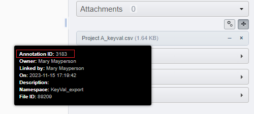

=====================
Parameter description
=====================

Data Type
---------
In combinaison with the parameter "*IDs*", this selects the object \
from which targets are selected (targets of the given type).

For example, if "*Data Type*" is set to **Project**, and "*ID*" to 789, it will select the **Datasets** \
inside if "*Target Data Type*"" is set to **Dataset**.

The "*Data Type*" can also be set to **Tag**, in which case the tagged objects of the "*Target Data Type*" \
are selected. This can be used for a more flexible selection of target object to process.

IDs
---
IDs of the object for the "*Data Type*" selection.

Multiple ID separated with a comma can be provided at the same time. In this case, \
the objects are processed sequentially (if the script fails at the 3rd object, the 1st and 2nd \
will already be processed).

Target Data Type
----------------
The data type to be selected for processing by the script. Default to "*<selected>*" means that the \
objects specified by "*Data Type*" and "*IDs*" are the ones to be processed. Otherwise, "*Target Data Type*" \
must correspond to a child object of the selected type (Image is child of Dataset and Project, \
Well is child of Screen and Plate, ...). The option "*<all (from selected)>*" is used to apply the script \
on the selected object and its children (Datasets and Images in the case of a Project selected).

File Annotation
---------------
Parameter for the import from a CSV file. Provided from the "*Choose File*" selection menu, \
the file will be temporarily uploaded to OMERO for the duration of the script.

The items listed in the CSV are matched to the found target objects. If an item of the CSV correspond to no \
target object, the item is skipped (as such, target objects coming from different parent objects can be \
annotated from a single CSV).

The matching of items in the CSV to target objects is done either via IDs or names (IDs have priority over names, \
see "*Target ID colname*"" and "*Target name colname*"").

IDs of File Annotation already attached to the object can be used instead of "*Choose File*":

Namespace
---------
In the case of Key-Value pairs import, the Namespace assigned to the created Key-Value pairs.

For the three other scripts, used to restrict the selection of Key-Value pairs to that Namespace.

When no Namespace is provided, matches the Namespace ``openmicroscopy.org/omero/client/mapAnnotation``, which \
makes the Key-Value pairs editable in OMERO.web (the only Namespace that allows that).

Multiple Namespaces can be provided as a comma separated list.

All Namespaces can be selected using the * character.

Old Namespace
-------------
For the Namespace conversion script. List of old Namespaces (comma separated) to convert to a different Namespace (unique). \
This can be used to group Key-Value pairs into a single annotation (all found Key-Value pairs will be grouped to a single\
MapAnnotation ( = one block of Key-Value pairs).

New Namespace
-------------
For the Namespace conversion script. The new Namespace to assign to the Key-Value pairs found on the target \
object having the "*Old Namespace*".

Create new and merge
--------------------
For the Namespace conversion script. When checked, the script will create a single new annotation regrouping all the old \
annotation it found, instead of only updating the Namespace of each annotations. The same parameter can be given to \
"*Old Namespace*" and "*New Namespace*" just to regroup the annotations.

CSV separator
-------------
For the import script, the separator used in the CSV to separate elements. By default \
set to 'guess' and will attempt to detect automatically the separator among ``,`` ``;`` ``TAB`` ``|``.

For the export script, the separator used in the generated CSV to separate elements. We \
recommend the use of TAB.

Include parent container names
------------------------------
For the export script. Check the box if you want to include in the CSV output \
for each objects the name of their parent containers.

The possible parents are PROJECT, DATASET, SCREEN, PLATE, RUN, WELL, depending on which object type \
is exported. These columns are ignored by default by the import script (see "*Columns to exclude*")

Include namespace
-----------------
For the export script. Check the box if you want to include in the CSV the Namespace \
associated to each Key as the first row of the document. (this output is understood by the import script).

Include tags
------------
For the export script. Check the box if you want to include in the CSV a column for the Tags \
attached to the target objects. The Tags are in the TAG[TAGSET] format if the Tags are part of a Tagset.

Split values on
---------------
For the import script. The characters used to split the cells in the CSV into multiple entries. \
The character used here must be different from the chosen CSV separator character.

Columns to exclude
------------------
For the import script. If the columns specified here are found in the CSV, they will be ignored by the script.

Three default special Values are given. <ID> corresponds to the name of the column for the object IDs specified by the \
parameter `Target ID colname`_. <NAME> corresponds to the name of the column for the object IDs specified by the \
parameter `Target name colname`_. <PARENT> corresponds to all possible parent containers type exported when using the \
parameter `Include parent container names`_.

Target ID colname
-----------------
For the import script. The name of the column in the CSV containing the objects IDs. If not present, \
the script will attempt to match the target objects by name. Defaults to OBJECT_ID as used by the export script.

Target name colname
-------------------
For the import script. The name of the column in the CSV containing the objects names. \
The names are used only to identify target objects if the ID column is not present. Defaults to \
OBJECT_NAME as used by the export script.

Exclude empty values
--------------------
For the import script. Check this box if you wish to avoid creating an entry in the Key-Value \
pairs when a cell in the CSV is empty.

Attach CSV file
---------------
For the import script. Check this box if you wish to attach the chosen CSV file to the object used for the \
selection of targets.

Import tags
-----------
For the import script. Disable if you wish to ignore the Tag \
columns during the import of annotation.

Only use personal tags
----------------------
For the Key-Value pair import script. When Tags are specified in the CSV (under a column named TAG), check this box \
if you want to restrict the use of Tags to Tags owned by you.

Allow tag creation
------------------
For the Key-Value pair import script. When Tags are specified in the CSV (under a column named TAG), check this box \
if you want to allow the creation of Tags when they don't exist. This also applies to Tagsets.

:Authors:
    Tom Boissonnet

:Version: 1.0 of 2024/03/01