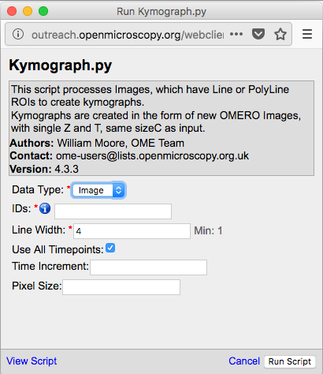
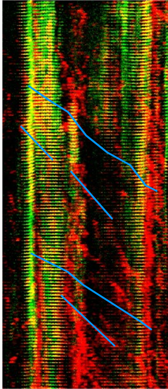

**Server side scripts**
=======================

The server-side python scripts on OMERO give an opportunity to run the analysis close to the data.

Description:
------------

The server-side python scripts on OMERO can be accessed via both the OMERO.web and OMERO.insight user interfaces. The scripts are typically uploaded by an administrator or a restricted administrator of the OMERO.server and can be run by any user on the server.

First, two examples are presented showing the experience from the user interface of OMERO.web (Batch ROI export and Kymograph).

Second, the process of writing, uploading and editing of OMERO script is explored

Setup:
------

No specific setup needed.

**Resources:**
--------------

-  Images for the Batch ROI Export.py script see \ https://downloads.openmicroscopy.org/images/DV/siRNAi-HeLa/

-  Images for Kymograph script were downloaded from \ http://jcb.rupress.org/content/194/2/187\ .(Bowen et. al. Journal of Cell Biology 194 (2): 187).

-  The simple example script is available on \ https://raw.githubusercontent.com/ome/training-scripts/master/practical/python/server/hello_world.py

Step-by-Step:
-------------

1.  We will now analyse the ROIs created in OMERO.iviewer using a server-side script.

2.  Go to the siRNA-HeLa Dataset and open several images whose name start with VRAQ… in OMERO.iviewer.

3.  We want to measure the distance between Centromeres, stained with ACA in the 4th Channel. Turn on ONLY the 4th channel and open the ROIs tab to on the right-hand pane.

4.  Draw several lines between the centromeres as indicated on the screenshot below. \ |image1a|

5.  Try to identify centromere pairs:

    a. Select the Line tool and draw a line between the centres of the centromeres.

    b. In the ROIs table, in the Comments column, click the 3 dots in the column header and choose to Show Area/Length.

6.  Do the same now on several of the Images whose names start with IN..., which are in the Metaphase state.

7.  Select Dataset siRNA-HeLa.

8.  Click the Script button in the top-right of the page \ |image2a|\ .

9.  Select export_scripts > Batch_ROI_Export…

10. In the dialog that pops up, click on View Script to view the Python code.

11. Search for “\ idr\ ” to find the code block that selects the filter_channel based on Dataset and Channel names.

12. Scroll to the bottom of the script to see where the input parameters are defined, such as Data_Type and IDs. Note how these appear in the script dialog and are auto-populated with the currently-selected Datasets or Images.

..

   |image3a|

13. The script will process all the Images in the selected Dataset and data can be exported as CSV file, with one table row per Shape/Channel.

14. Click Run Script.

15. The status of the processing is displayed in the Activities dialog |image4a|\ .

16. When the script has completed, it will show in the Activities dialog and allow you to download the CSV file. Download this and open it, e.g. in Excel, to see the output data for all the shapes.

We will now use another server-side script for creating a Kymograph from an Image in OMERO. The Image we will use for the Kymograph demonstration has been published in a study investigating protein migration along microtubules \ http://jcb.rupress.org/content/194/2/187\ .(Bowen et. al.
Journal of Cell Biology 194 (2): 187).

1. Go to the Dataset Kymograph.

2. Select the Image inside the Dataset.

3. Double-click to open the Image in OMERO.iviewer and draw one or more lines along microtubules which seems to have the most persistent trafficking of objects along them.

4. Save the line(s).

5. Go back to the webclient. Click the Script button in the top-right of the page\ |image2a|\ .

..

   |image5a|

6.  Select workshop_scripts > Kymograph...

7.  The script will create a new image (=Kymograph) where the pixels under the line region you have drawn previously will be collated into this image timepoint by timepoint. The row of pixels from the first timepoint will be on the top of the new Kymograph Image.

8.  Note: the direction in which you have drawn the line ROI on the original image matters with respect to the orientation of the stripes composing the Kymograph image. The start of the original line is on the left of the Kymograph Image, the end on the right.

9.  Open the new Kymograph image in OMERO.iviewer.

10. Find some tracks (typically red stripes going under angles across the image, see screenshot below).

..

   |image6a|\ |image7a|

11. Draw some lines over these tracks and save them.

12. Go back to the webclient, select the Kymograph Image and select the script analysis > Kymograph analysis...

13. Run this script. The Kymograph analysis script will produce a CSV file attachment on the Kymograph Image.

14. Open the CSV in Excel for example and verify the speeds of the observed particles in the original image.

**How to write a server-side script**
=====================================

The server side script follows some simple steps so that a simple UI can be generated automatically.

In this section we will show how to write a simple script and upload it to the OMERO.server: The user will specify a Dataset and the script will be uploaded by the OMERO.server administrator (or administrator with restricted privileges) to the OMERO.server. If the script is uploaded as “official”, it can be run by all users on the OMERO.server after upload. The script demonstrated here is very simple, it just loads the images contained in a dataset.

See \ https://raw.githubusercontent.com/ome/training-scripts/master/practical/python/server/hello_world.py

1. Click on the link above and copy and paste the script into a text editor of your choice.

2. Study the composition of the script - the script is taking a Dataset ID and produces an output of all the images contained in that dataset. This is of course just a springboard for further work with the images in a more advanced script.

3. (demo only) The script can be immediately uploaded to the OMERO.server in this present state, using

   a. OMERO.insight, the sixth icon from the left, top-left of the UI |image8a|\  (Note that only admins and restricted admins will see this icon in OMERO.insight).

   b. Command line interface (CLI0 using the command.
   
   ::

         $ bin/omero script upload test-script1.py --official

4. After the demonstrator uploaded the script, you can

   c. Go to OMERO.web and select any dataset in the left-hand tree

   d. Above the central pane, find the “cogs” icon with scripts

   e. Find the newly uploaded script.

   f. Click on the menu item, the script dialog will be already pre-populated with the ID of the selected Dataset.

   g. Click Run.

**How to manage a server-side script**
======================================

Please refer to \ `https://docs.openmicroscopy.org/omero/5.4.10/developers/scripts/user-guide.html <https://docs.openmicroscopy.org/omero/5.4.10/developers/scripts/user-guide.html#omero-scripts-user-guide>`__\  for how to write other simple scripts, execute, edit and delete them.

.. |image1a| image:: images/scripts1.png
   :width: 5.9975in
   :height: 3.64063in
.. |image2a| image:: images/scripts2.png
   :width: 0.36621in
   :height: 0.27231in
.. |image3a| image:: images/scripts3.png
   :width: 3.83333in
   :height: 5.04167in
.. |image4a| image:: images/scripts4.png
   :width: 0.25391in
   :height: 0.20833in

.. |image6a| image:: images/scripts6.png
   :width: 1.58333in
   :height: 2.84896in

.. |image8a| image:: images/scripts8.png
   :width: 0.32292in
   :height: 0.33333in
