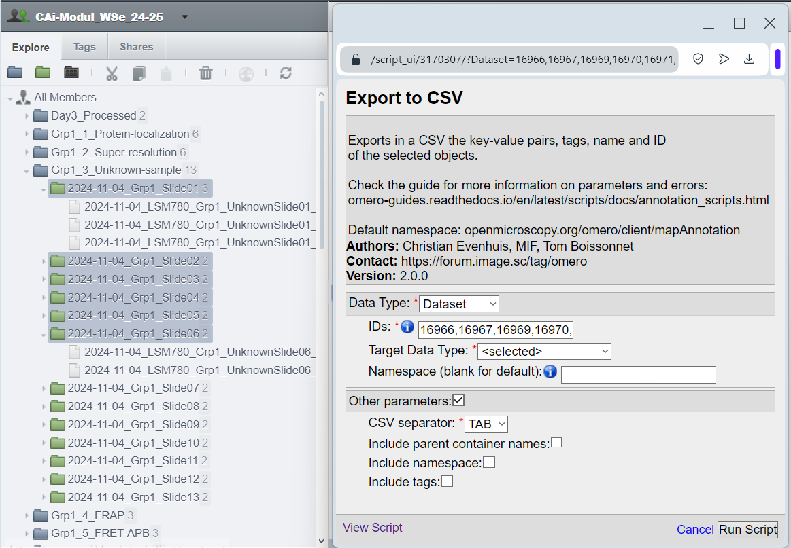
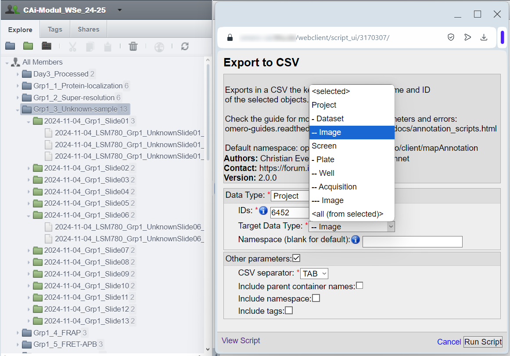
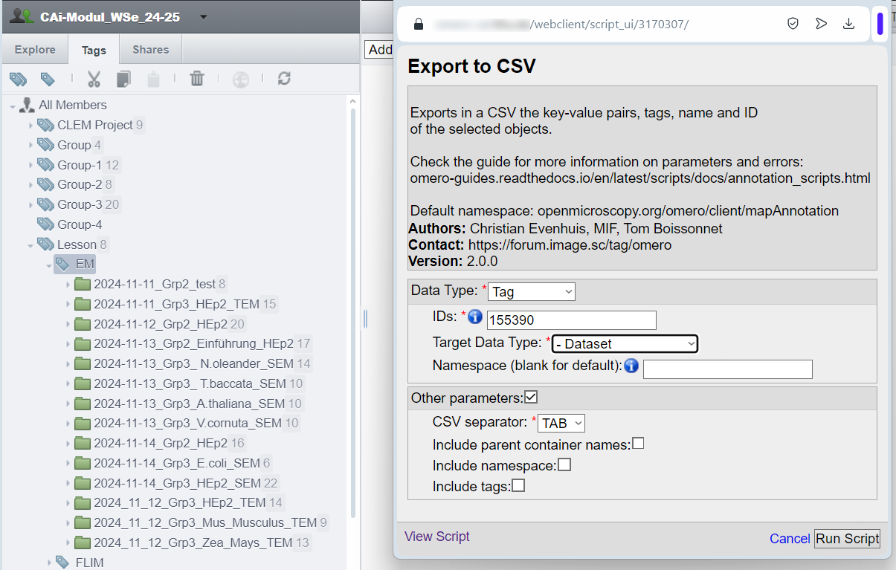

===========
Walkthrough
===========

The aim of the four Annotation scripts is to provide a way to edit \
Key-Value pairs (MapAnnotations) and Tags (TagAnnotations) by batch:

* Import Key-Value pairs and Tags as Annotations from a .csv file
* Export Key-Value pairs and Tags to a .csv file
* Delete Key-Value pairs
* Convert the namespaces of Key-Value pairs

This walkthrough should give you an understanding of \
the scripts and help you to manage your annotations.

Object selection with the scripts
---------------------------------

The object selection logic is the same for all four scripts. In OMERO there are \
two distinct hierarchies:

* **Projects** → **Datasets** → **Images**
* **Screens** → **Plates** → (**Wells** or **Acquisition/Run**) → **Images**

More details about selecting High-Content-Screening are given \
elsewhere (see :doc:`Selecting High-Content-Screening </extended_description>`).

The scripts offer 4 ways of selecting the objects to work with.

Direct selection
^^^^^^^^^^^^^^^^
Simply select the all the desired objects. Opening the script \
after selecting the object will prefill the script parameters with the right \
object type and IDs:

   *Selection of multiple datasets and the auto-filled Export to CSV script.*
..

For the direct selection, leave the Target Data Type as "*<selected>*" \
(in this example, choosing **Dataset** would also work).

Children selection
^^^^^^^^^^^^^^^^^^
Instead of selecting the objects one by one, we can select the parent object \
and indicate in the "*Target Data Type*" the children objects \
we want to select.

   *Selection of all the images of a project and the auto-filled Export to CSV script.*
..

In this example, all the **Images** found under the **Project:701** are selected.

Tag selection
^^^^^^^^^^^^^
You can use the Tags to select the images or other objects you want to work with.  \
Do not confiuse this option with the exporting of tags also provided by the scripts. The usage of tags  \
for object selection grants additional flexibility. You can for example select objects \
attached to different projects or belonging to different owners. \

   *Selection of a subset of datasets from a tag and the auto-filled Export to CSV script.*
..

In this example, all the **Datasets** found under the **Tag:155390** are selected. \
Note that choosing "*<selected>*" for "*Target Data Type*" will result in an \
error in this case.

All from selected
^^^^^^^^^^^^^^^^^
The fourth option is to apply the scripts to all of the selected objects and the children  \
objects. Selecting a Project and using the option **<all (from selected)>** with result in \
applying the scripts to the selected project, to the linked datasets and the linked images \
bellow. Note that this option does not exist for the import of annotation from csv.

Exporting annotations
---------------------

Exporting annotations creates a .csv file with headers compatible with the import script. \
It can be used for:

* Export key-value pairs (along with data like namespaces and tags) for modification or \
  transferring annotations between groups.
* Export a list of objects with their names and IDs (and excluding key-value pairs by \
  specifying an unused namespace).

   *Exported .csv with only the object ID and name*
..

Importing annotations
---------------------

Starting from the file we exported as explained in the previous section, \
we proceed to edit it within a spreadsheet editor, adding more columns to the csv, \
You can also insert a row on the top of .csv to specify the namespace for each key:

   *Result of populating the csv shown in a text editor*
..

We added several columns to annotate our dataset with Key-Value pairs \
following the `REMBI <https://doi.org/10.1038/s41592-021-01166-8>`_ guidelines \
(after saving the document, our ``TAB`` separator became ``,``).

We proceed and start the script "*Import from CSV*".

   *Selection of all the datasets of a project and the Import from CSV script.*
..

There are many parameters here that could help you fine tune the way to import annotations. More \
on that in the :doc:`parameter description section</parameter_description>` of this guide.

The Key-Value pairs were added to 5 datasets out of the 11 present in this project, as expected. \
We also obtain three sets of Key-Value pairs, one for each namespace used in the csv.

  *The script output (5 entries in the csv matched to 5 dataset out of 11) and the\
  resulting key-value pairs annotation.*
..

Converting the Key-Value pairs namespace
----------------------------------------

Key-Value pairs are grouped under categories called namespaces. This allows \
flexibility to distinguish or isolate annotations, such as exporting or deleting \
only those associated with a specific namespace.

.. note::
   When you create Key-Value pairs in OMERO.web, you use \
   namespaces without noticing it: OMERO assigns by default the \
   "Client namespace" (``openmicroscopy.org/omero/client/mapAnnotation`` in full)\
   , a special namespace recognized by OMERO.web.

The "Client namespace" (see note above) is the only namespace that allows editing of \
Key-Value pairs in the OMERO.web interface. If a Key-Value pair uses a different \
namespace, its namespace must first be converted to the "Client namespace" before editing. \
These annotation scripts will always default to the "Client namespace" if the namespace \
fields are left empty.

  *The script to convert the namespace of key-value pairs annotations.*
..

And here is our five Key-Value pairs annotations with converted namespace:

  *The script output (5 dataset had annotations with the default namespace) and the\
  resulting key-value pairs annotation.*
..

Once the Key-Value pair has been converted to the "Client namespace," it can be edited \
in the OMERO.web interface.

Deleting Key-Value pairs
------------------------

It turns out that there are more than a few edits to do on our key-value pairs, and \
converting back and forth the namespace seems too tedious this time. Let's instead export \
what we have so far (we have done edits that we don't want to lose), delete "old" the key-value pairs, \
and reimport when we are done fixing them.

Using the same selection inputs for both scripts, we make sure that we have the key-value pairs on our \
computer before deleting them.

.. warning::
   To export or delete multiple namespaces simultaneously, you can use the * wildcard to include \
   all Key-Value pairs, regardless of their namespaces. However, use this feature with caution, \
   as deleted annotations cannot be recovered without a backup.

Because there is no undo with the deletion of data from OMERO, think twice while checking the confirmation box and clicking \
the "Run script" button.

  *The two scripts used one after another. Export the annotations for backup \
  before removing them from the server with the Remove KV script.*
..

We can now make the necessary edits in the .csv file and reupload the Key-Value \
pairs!.

Make sure to check the :doc:`extended guide </extended_description>` to learn about what else you can \
do with those scripts.

:Authors:
    Tom Boissonnet

:Version: 1.0 of 2024/03/01