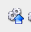

How to write a server-side script
=================================

The server side script follows some simple steps so that a simple UI can be generated automatically.

In this section we will show how to write a simple script and upload it to the OMERO.server: The user will specify a Dataset and the script will be uploaded by the OMERO.server administrator (or administrator with restricted privileges) to the OMERO.server. If the script is uploaded as "official", it can be run by all users on the OMERO.server after upload. The script demonstrated here is very simple, it just loads the images contained in a dataset.

See \ https://raw.githubusercontent.com/ome/omero-guide-python/master/scripts/hello_world_server.py.

#. Click on the link above and copy and paste the script into a text editor of your choice.

#. Study the composition of the script - the script is taking a Dataset ID and produces an output of all the images contained in that dataset. This is of course just a springboard for further work with the images in a more advanced script.

#. (demo only) The script can be immediately uploaded to the OMERO.server in this present state, using

   - OMERO.insight, the sixth icon from the left, top-left of the UI |image8a|\  (Note that only admins and restricted admins will see this icon in OMERO.insight).

   - Command line interface (CLI) using the command.
   
   ::

         $ bin/omero script upload test-script1.py --official

#. After the demonstrator uploaded the script, you can

   - Go to OMERO.web and select any dataset in the left-hand tree

   - Above the central pane, find the "cogs" icon with scripts

   - Find the newly uploaded script.

   - Click on the menu item, the script dialog will be already pre-populated with the ID of the selected Dataset.

   - Click Run.

